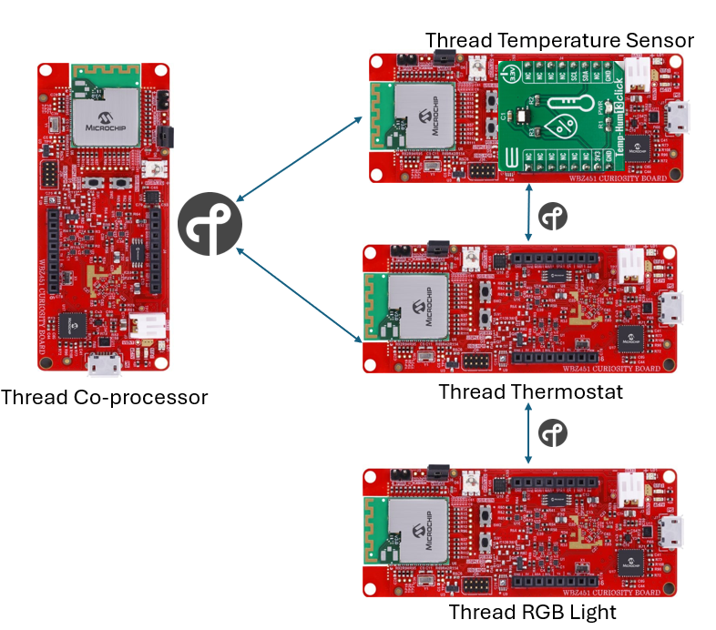
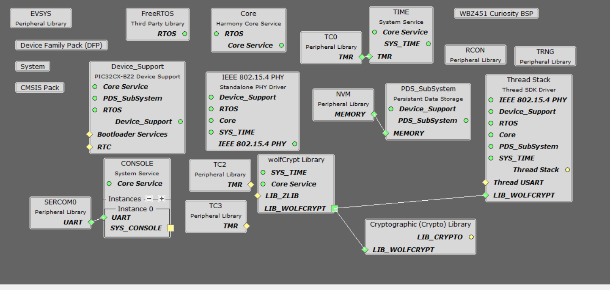
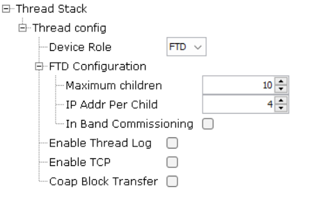
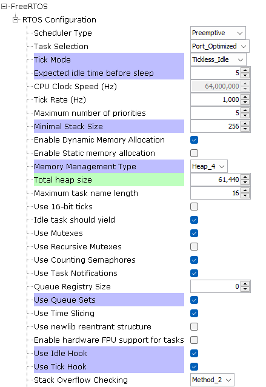
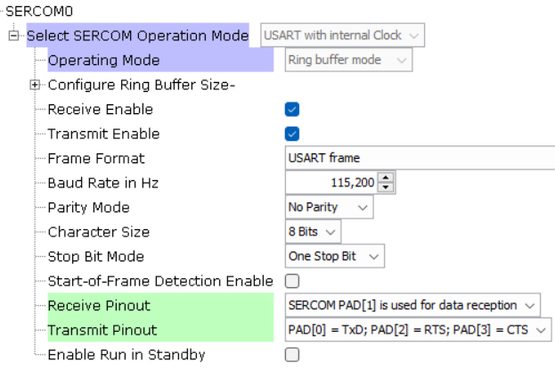
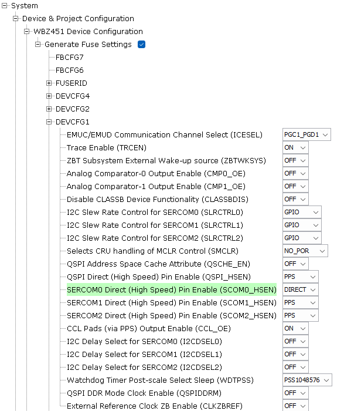
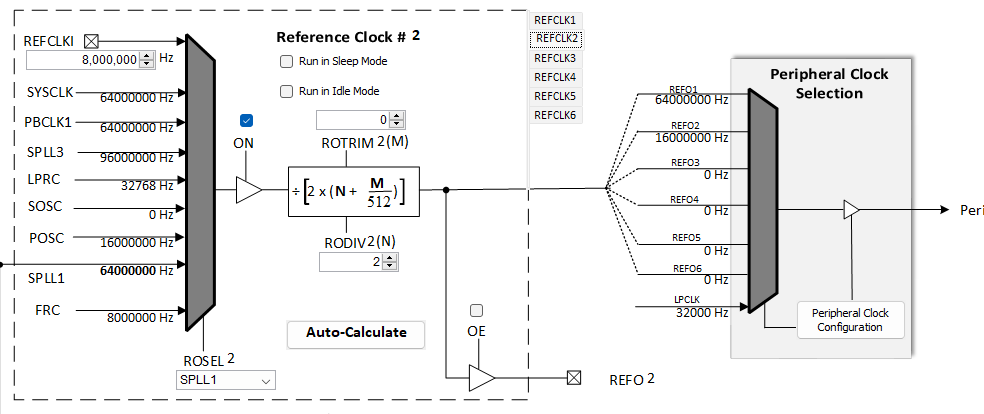
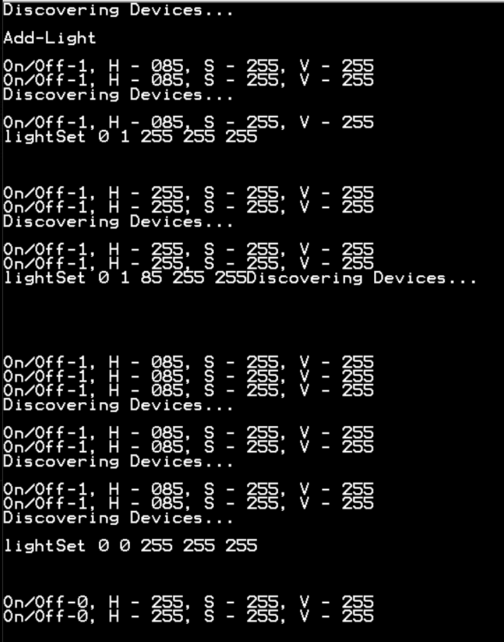

# PIC32CXBZ2_WBZ45x THREAD RGB LIGHT

> "IoT Made Easy!" 

Devices: **| PIC32CXBZ2 | WBZ45x |** 
Features: **| OpenThread |**

## ⚠ Disclaimer

<b>
THE SOFTWARE ARE PROVIDED "AS IS" AND GIVE A PATH FOR SELF-SUPPORT AND SELF-MAINTENANCE. This repository contains example code intended to help accelerate client product development.  

For additional Microchip repos, see: <a href="https://github.com/Microchip-MPLAB-Harmony" target="_blank">https://github.com/Microchip-MPLAB-Harmony</a>

Checkout the <a href="https://microchipsupport.force.com/s/" target="_blank">Technical support portal</a> to access our knowledge base, community forums or submit support ticket requests.

</b>

## Contents

1. [Introduction](#step1)
1. [Bill of materials](#step2)
1. [Software Setup](#step3)
1. [Harmony MCC Configuration](#step4)
1. [Board Programming](#step5)
1. [Run the demo](#step6)

## 1. Introduction<a name="step1">

This application enables the users to create a Full Thread Device to control on-board RGB LED. Thread RGB Light receives the On/Off and HSV value from the [Thread co-processor device](https://github.com/MicrochipTech/PIC32CXBZ2_WBZ45x_THREAD_co-processor) once it has joined the thread network. On-board RGB LED is set to corresponding the On/Off and HSV values using multiple PWM signals. Also the current status is reported periodically to [Thread co-processor device](https://github.com/MicrochipTech/PIC32CXBZ2_WBZ45x_THREAD_co-processor).

| Tip | Go through the [overview](https://onlinedocs.microchip.com/oxy/GUID-2DB248AF-C243-496D-9819-969E43CA63BC-en-US-1/GUID-162D7BE7-3A35-4D12-AE09-EE84C6554377.html) for understanding few key Thread protocol concepts |
| :- | :- |

## 2. Bill of materials<a name="step2">

| TOOLS | QUANTITY |
| :- | :- |
| [PIC32CX-BZ2 and WBZ451 Curiosity Development Board](https://www.microchip.com/en-us/development-tool/EV96B94A) | 1 |

## 4. Software Setup<a name="step4">

- [MPLAB X IDE ](https://www.microchip.com/en-us/tools-resources/develop/mplab-x-ide#tabs)

    - Version: 6.20
	- XC32 Compiler v4.40
	- MPLAB® Code Configurator v5.5.0
	- PIC32CX-BZ_DFP v1.0.107
	- MCC Harmony
	  - csp version: v3.18.5
	  - core version: v3.13.4
	  - bsp version: v3.18.0
	  - CMSIS-FreeRTOS: v11.1.0
	  - dev_packs: v3.18.1
	  - wolfssl version: v5.4.0
	  - crypto version: v3.8.1
	  - wireless_pic32cxbz_wbz: v1.3.0
	  - wireless_15_4_phy version: v1.1.1
	  - wireless_thread: v1.0.1
	  - openthread version : mchp_harmony_wireless_thread_v1.0.0

- Any Serial Terminal application like [TERA TERM](https://download.cnet.com/Tera-Term/3000-2094_4-75766675.html) terminal application

- [MPLAB X IPE v6.00](https://microchipdeveloper.com/ipe:installation)

## 5. Harmony MCC Configuration<a name="step5">

### Getting started with RGB Light application in WBZ451 Curiosity board 

| Tip | New users of MPLAB Code Configurator are recommended to go through the [overview](https://onlinedocs.microchip.com/pr/GUID-1F7007B8-9A46-4D03-AEED-650357BA760D-en-US-6/index.html?GUID-B5D058F5-1D0B-4720-8649-ACE5C0EEE2C0) |
| :- | :- |

**Step 1** - Connect the WBZ451 CURIOSITY BOARD to the device/system using a micro-USB cable.

**Step 2** - Create a [new MCC Harmony project](https://github.com/MicrochipTech/EA71C53A/blob/master/H3/wireless_apps_pic32cxbz2_wbz45/apps/docs/creating_new_mplabx_harmony_project.md#creating-a-new-mcc-harmony-project).

**Step 3** - The "MCC - Harmony Project Graph" below depicts the harmony components utilized in this project.

- From Device Resources, go to Libraries->Harmony->Board Support Packages and add WBZ451 Curiosity BSP.
 
- From Device Resources, go to Libraries->Harmony->Wireless->Drivers->Thread and add Thread Stack. Click "Yes" on all the Pop-ups to add the link the dependencies.

- Ensure the configuration of Thread Stack is as below.

- Ensure the configuration of FreeRTOS is as below. Total heap size should be 61440.

- In FreeRTOS configuration options, go to RTOS Configurations->Include components and make sure xTaskAbortDelay is selected.

- From Device Resources, go to Libraries->Harmony->System Services and add CONSOLE. Ensure the below configuration.

- Right Click on UART of CONSOLE and add SERCOM0 as below. Ensure the configurations.

- Modify the System Configuration as below.

- From Device Resources, go to Libraries->Harmony->Peripherals->TC add TC2 and TC3. Ensure the below configuration.

- In Plugins->Clock Configuration, ensure the below configurations.

- In Plugins->Pin Configuration, ensure the below configurations for RB0, RB3 and RB5 pins.

**Step 4** - [Generate](https://onlinedocs.microchip.com/pr/GUID-A5330D3A-9F51-4A26-B71D-8503A493DF9C-en-US-1/index.html?GUID-9C28F407-4879-4174-9963-2CF34161398E) the code.
 
**Step 5** - In "app_user_edits.c", make sure the below code line is commented 

- "#error User action required - manually edit files as described here".

**Step 6** - Copy the mentioned files from this repository by navigating to the location mentioned below and paste it your project folder. 

| Note | This application repository should be cloned/downloaded to perform the following steps. |
| :- | :- |

- Copy "Thread_demo.c" and "Thread_demo.h" files available in "...firmware\src"
- Paste the files under source files in your project folder (...\firmware\src).

**Step 7** - Add the files in MPLAB X IDE to your project by following the steps mentioned below.

- In Projects section, right click on Source files to add the ".c" file and Header files to add the ".h" file.
- Select "Add existing item".
- Select Add and browse the location of the mentioned files(...\firmware\src). 
- Make sure the "Files of type" is "C Source files" while adding ".c" files and "Header files" while adding ".h" files.
- Select the folder and click "add".

**Step 6** - Copy the mentioned files from this repository by navigating to the location mentioned below and paste it your project folder. 

| Note | This application repository should be cloned/downloaded to perform the following steps. |
| :- | :- |

- Copy "app.c" and "app.h" files available in "...firmware\src"
- Paste the files under source files in your project folder (...\firmware\src).

**Step 7** - Clean and build the project. To run the project, select "Make and program device" button.

## 5. Board Programming<a name="step5">

### Program the precompiled hex file using MPLAB X IPE

The application hex file can be found in the hex folder.

Follow the steps provided in the link to [program the precompiled hex file](https://microchipdeveloper.com/ipe:programming-device) using MPLABX IPE to program the pre-compiled hex image. 

### Build and program the application using MPLAB X IDE

Follow the steps provided in the link to [Build and program the application](https://github.com/Microchip-MPLAB-Harmony/wireless_apps_pic32cxbz2_wbz45/tree/master/apps/ble/advanced_applications/ble_sensor#build-and-program-the-application-guid-3d55fb8a-5995-439d-bcd6-deae7e8e78ad-section).

## 7. Run the demo<a name="step7">

- Once the gateway device is powered on the RGB Light will join the network. The status of the RGB light will be periodically reported to Thread Co-Processor. Thread Co-Processor can control the status of RGB like On/Off and HSV using commands explained in [Thread co-processor device](https://github.com/MicrochipTech/PIC32CXBZ2_WBZ45x_THREAD_co-processor).

Below prints can be seen in [Thread co-processor device](https://github.com/MicrochipTech/PIC32CXBZ2_WBZ45x_THREAD_co-processor).

